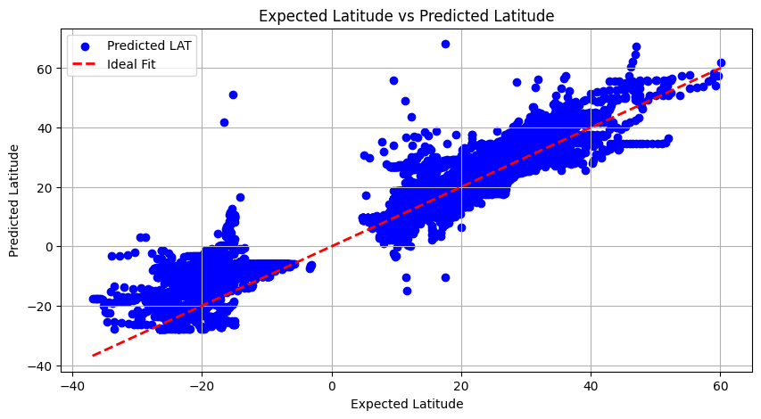

<div align="center">
 
</div>

# Orkanskader

Harnessing data to forecast hurricane impact and financial losses.

### About
**_orkanskader_**, a term for "hurricane damage" in Norwegian, is a project intent on analyzing the radial impact of hurricanes based on historical data.

The project consists of a couple of segments,
1. estimating the radial impact of hurricanes based on historically observed data.
2. mapping the affected areas based on damage severity via proximity to the eye of storm.
3. estimating the overall and categorical financial losses incurred by owners of residential properties affected by the storm. 
4. if we're lucky, we may add another components to estimate loss to insurance companies!

### Team Members
- Venkata Datta Adithya Gadhamsetty
- Matthew Brownrigg
- Beatrix Wen
- Richard Zhang

## How to build
This project was built using conda environment manager so it is recommended you use a conda distribution.
With conda you can use the `orkan.yml` file with:

```
$ conda env create -f orkan.yml
```

This will install all the requisite libraries to run our files.

## Running the Hurricane Range Predictive Model

- Rmax prediction: 
Run `Rmax_Prediction.ipynb`
- Rmax specific to Florida region: 
Run `Rmax_Prediction_FL.ipynb`
- Hurricane location prediction: 
Run `Deep_Learning_Hurricane_Location.ipynb`

### Results from the Hurricane Range Prediction
<div align="center">
 
</div>
<div align="center">
 
</div>


## Running the Damage Model

Use the BASH script `run.sh` located in `src/` to generate a hurricane damage model. 
To properly run `run.sh` you need the following parameters:

```
$ cd src
$ bash run.sh <longitude [-79.0,-84.0]> <latitude [24.0,31.0]> <radius_64 (km)> <radius_max (km)>
```

The diagram will be generated in `data/` as `hurricane@(<long>,<lat>&<radius_max>)`.
The estimated damage will appear as printed text on the console.

### Results from Running Damage Model
```
$ bash run.sh -80.1918 25.7617 120 60
```
<div align="center">
 
</div>

